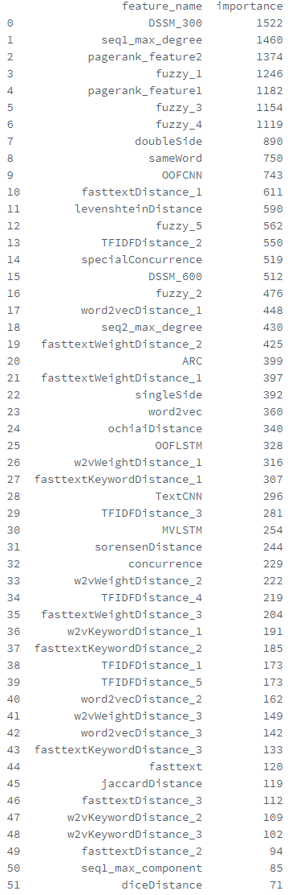
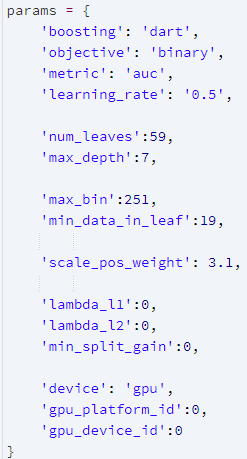
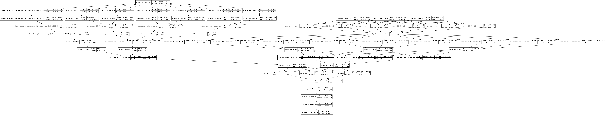
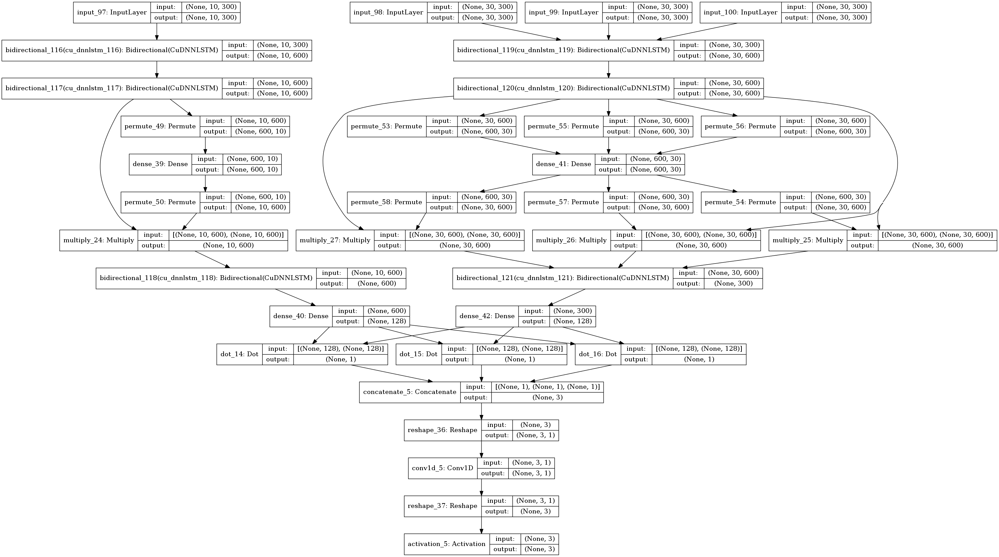
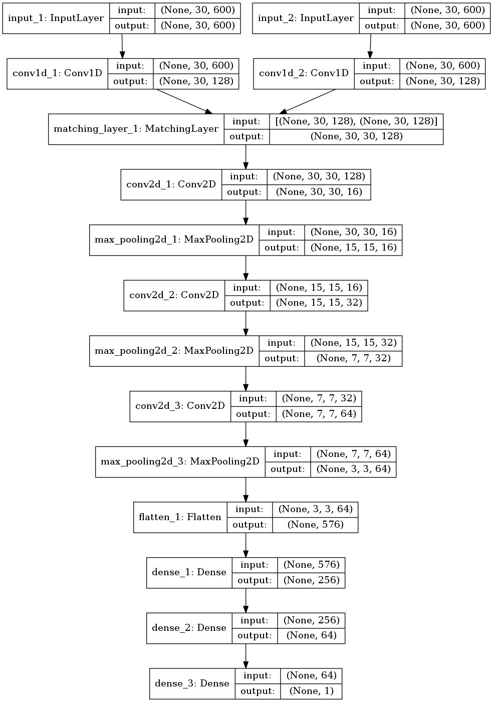

# 2019中国高校计算机大赛——大数据挑战赛 WriteUp

我们是最终排名第 15 名的**改革春风吹满地**队伍，对方法和模型进行了简单的整理。

   * [2019中国高校计算机大赛——大数据挑战赛 WriteUp](#2019中国高校计算机大赛大数据挑战赛-writeup)
   * [传统模型](#传统模型)
      * [query和title去重](#query和title去重)
      * [图特征](#图特征)
      * [词向量特征](#词向量特征)
      * [特征重要性分析](#特征重要性分析)
      * [LightGBM模型](#lightgbm模型)
         * [LightGBM参数](#lightgbm参数)
         * [训练](#训练)
   * [深度模型](#深度模型)
      * [CNN-DSSM](#cnn-dssm)
      * [LSTM-DSSM](#lstm-dssm)
      * [mvlstm](#mvlstm)
      * [ARC II](#arc-ii)

# 传统模型

## query和title去重

训练词向量以及词频统计是query和title需做去重处理

## 图特征

*每一个query或title都作为图中唯一一个节点,基于query与title的句子对构建边。计划构建无向图以及权重图。无向图规模最大建立了一亿三千万数据量的图，生成图的过程把query和title都转换成一个Int32的ID值，减少内存消耗。*

> Trick：利用Pickle保存、读取图是最快的，文件的体积也是最小的。

无向图特征——最大完全子图max_clique：最大完全子图的大小(特征效果提升不明显，舍弃！）。

无向图特征——边连接数max_degrees：统计每个节点的边连接数

无向图特征——最大连通子图规模max_components：统计每个节点最大连通子图规模

无向图特征——pagerank值：根据Google的pagerank算法计算每个节点的pagerank值，这个虽然我们使是使用无向图进行计算的，但是pagerank是通过迭代计算每个节点的入度来评判每个节点的重要程度。所以在运行pagerank算法的时候会默认把无向边连接转化成双向的边连接。

无向图特征——HITS算法A值和H值：时间关系没有训练出HITS模型，不过HITS类似pagerank模型，在HIST算法中，分为Hub页面和Authority页面，Authority页面是指与某个领域或者某个话题相关的高质量页面，Hub页面则是包含很多指向高质量Authority页面链接的网页。HITS算法模型会给出每个节点的A值和H值用来评估节点的重要程度。

无向图特征——shortestpath：query和title之间的最短路径，对于共现的query和title我们会建立一条边，这样shortestpath会默认是1，所以在计算shortestpath特征的时候，我们会把这条边先删除，shortestpath计算结束后在重新加会这条边。

无向图特征——neighbour：邻居数，由于图过大计算邻居数会爆内存。在大数据量上，我们舍弃了这维度特征。

权重图特征：图特征的边的权重计划通过，query和title的句子词向量相似度或者BM25算法实现，由于时间紧张没有实现。大概特征类别等同于无向图特征，更多的是作为对于无向图特征的修正。

普通统计特征

*复赛提供15个核的CPU，利用multiprocessing库的进程池管理模块Pool，可以大大加快特征生成速度*

concurrence：query与title中相同词所占词总数比

levenshteinDistance： 编辑距离（后面通过fuzzywuzzy实现了更为详细的分析）

sorensenDistance：sorrensen距离

sameWord：query与title中相同词种类数，某个词出现label为1的概率乘积（需要初始化pos_prob）

distance： Dice Distance、Ochi DIstance、 Jaccard Distance

fuzzyDistance：通过fuzzywuzzy库(字符串模糊匹配工具)实现的详细编辑距离分析，包括简单匹配(Simple Ratio)、非完全匹配(Partial Ration)、忽略顺序匹配(Token Sort Ratio)、去重子集匹配(Token Set Ratio)

powerful words：统计label为1时，query和title中同时出现的单词词频(双边概率)、只出现在query或title中的单词词频(单边概率)

## 词向量特征

word2vecDistance：基于word2vec词向量的Cosine Distance、Euclidean Distance、Manhattan Distance。（后加入fasttext模型）

w2vWeightDistance：基于word2vec词向量，并考虑TF-IDF权重的Cosine Distance、Euclidean Distance、Manhattan Distance。（后加入fasttext模型）

NGramDistance：词粒度NGram距离（词粒度效果不好，舍弃！）

## 特征重要性分析

图中包括以上没介绍的特征，均为深度文本匹配模型的输出结果。 作为一维特征

## LightGBM模型

### LightGBM参数

### 训练

*训练集是采用十亿数据集中后三千万作为训练集，百分之二十作为验证集，保留原数据Label比例采样。*

# 深度模型

## CNN-DSSM

传统的CNN - DSSM 只用了一个卷积作为表示层，这里用了类似 TextCNN 的架构作为表示层，用了 kernel_size 不同的 6 个卷积层。

参考

http://research.microsoft.com/pubs/226585/cikm2014_cdssm_final.pdf

https://github.com/airalcorn2/Deep-Semantic-Similarity-Model/blob/master/deep_semantic_similarity_keras.py

## LSTM-DSSM

LSTM-DSSM 用 Bi-LSTM + Attention 作为 DSSM 的表示层。

## mvlstm

通过 Bi-LSTM 构造对齐矩阵，匹配句子之间的关系。

参考

https://github.com/NTMC-Community/MatchZoo/blob/master/matchzoo/models/mvlstm.py

## ARC II

参考

https://github.com/NTMC-Community/MatchZoo/blob/master/matchzoo/models/arcii.py